# Mimicking an M0110A Keyboard to interface with an Apple Macintosh Plus from the 80s

May. 2025

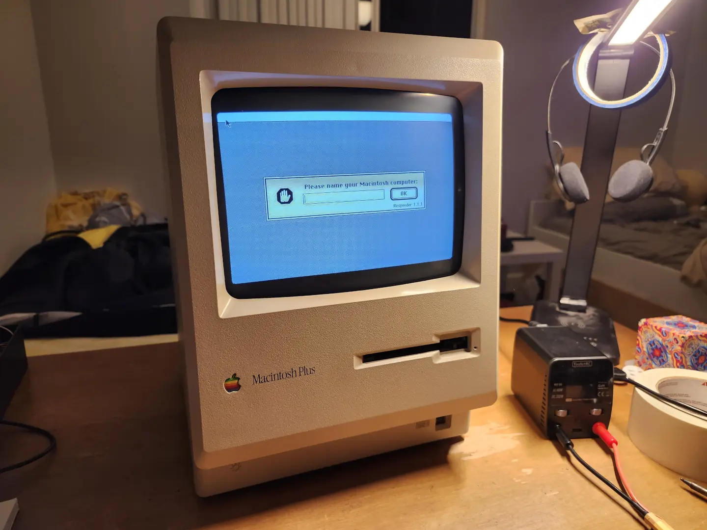

Last year, I finally got around to repairing and playing with an Apple Macintosh Plus that I had sitting around. I was in my 4th year of university working towards my capstone project and I desperately needed a fun distraction outside of coursework. That's when I stumbled upon a YouTube video of someone repairing and operating an old Macintosh. One can argue that as a Robotics Engineering student, a project involving electrical, mechanical, and programming tasks does not constitute a fun break from coursework but at least there were no stakes involved. The Macintosh Plus was one of the early compact macs released in 1986. I was curious about using floppy disks and really wanted to operate a computer that was more than 30 years old. What stopped me years ago was the lack of a keyboard and mouse but now I possess the power of online shopping. I ordered a mouse, a set of floppy disks, and a [BlueSCSI](https://bluescsi.com/) to boot from. Next up was the keyboard but after reading about the keyboard protocol, I decided to emulate it myself.

This post follows how I made an adapter to type on a Macintosh Plus using a modern USB keyboard. To emulate a Macintosh keyboard, I wrote [an M0110 Arduino library](https://github.com/zeropt/M0110) which anyone should be able to use with a SAMD microcontroller.

<br>

## Macintosh Plus

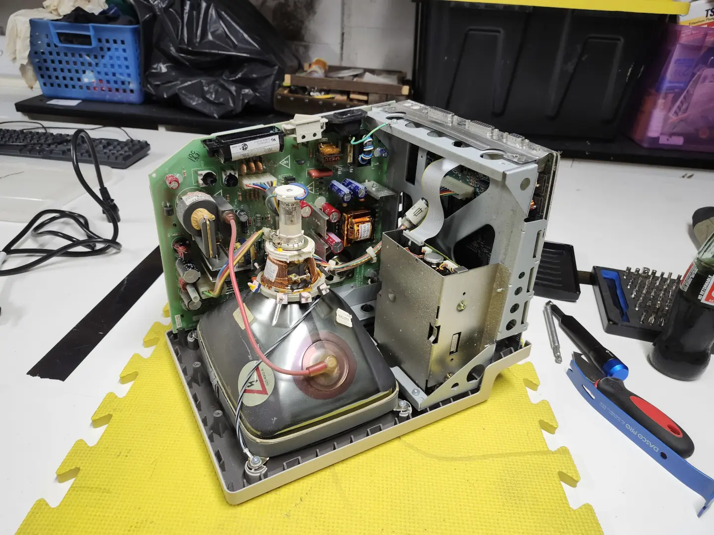

*Case removed, revealing the power board, motherboard, and floppy drive. <b style="color:indianred;">CAUTION! Make sure to discharge the HV power supply if you do this.</b>*

I found this adorable, beige computer at a second hand store years ago without any peripherals or disks. When powered on, the small black and white CRT lit up and displayed a floppy disk icon with a question mark. I later found out that this specific computer was made in 1989 and that these computers need a floppy disk inserted to boot. Opening it up revealed an elegantly simple system with only a CRT, floppy disk drive, and two large PCBs. The board mounted next to the CRT, called the analog board, is populated with the electronics for the power supply and controlling the CRT. The other board slotted at the base of the computer under the floppy drive is the motherboard with all the digital ICs and ports for peripherals.

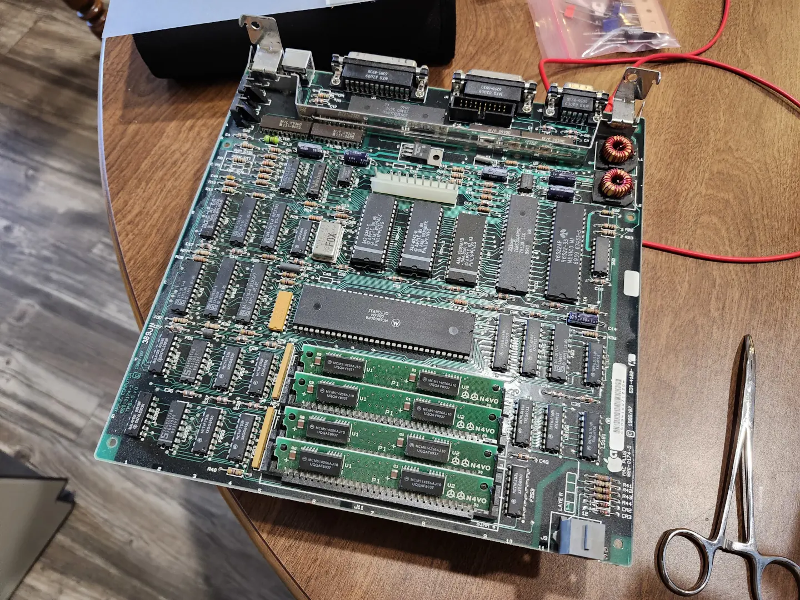

*Macintosh Plus motherboard*

The floppy drive in the Macintosh Plus accepts 800 KB DD floppy disks, not the 1.44 MB HD ones you'll often find. These were simple enough to order but can't be written to or read from using an off-the-shelf USB floppy drive. This meant that the Macintosh itself was the only device I had capable of creating an 800K boot disk. I thought about ordering a pre-made boot disk but ultimately decided to buy a [BlueSCSI](https://bluescsi.com/) which uses an SD card and a Raspberry Pi Pico to emulate an external hard drive. This gave me the flexibility to create a bootable drive and load software simply using an emulator on my laptop.

Other than sourcing peripherals and disks, there where only a couple of fixes I had to make. There is a surprisingly extensive online community around repairing and modding old compact macs and almost all of my problems could be solved with a quick google search. Thus, I'll only briefly list these fixes.

- The internal switch in the 3.5 mm audio jack, used to detect if a cable is plugged in, wasn't making good contact so I replaced it.
- One of the gears in the eject mechanism of the 800K floppy drive stripped. This happens to be a common problem so a 3D model for a replacement was available to print on a resin printer.
- I read that the RIFA capacitors in the power supply often fail so I replaced those as a precaution.
- I also upgraded the RAM from 1 MB to 4 MB.

<br>

## M0110 Keyboards

The Original Macintosh, Macintosh 512K, and Macintosh Plus does not use Apple Desktop Bus (ADB) ports to connect to its peripherals. The mouse connects through a dedicated port at the back of the computer and the keyboard to a dedicated port at the front. At first, I was planning to buy an M0110A keyboard, the model that originally came with the Macintosh Plus. Instead, I stumbled upon a site that documented the protocol used by the M0110 keyboards and decided to try bit banging the protocol with a microcontroller. Here are those sites that made this project possible:

- http://www.mac.linux-m68k.org/devel/plushw.php
- http://www.kbdbabel.org/signaling/
- https://github.com/tmk/tmk_keyboard/wiki/Apple-M0110-Keyboard-Protocol

The keyboards connect via RJ11 connectors like those used with wired telephones. The four pins are used for power and two data signals: one is a clock signal driven by the keyboard; and the other is a bidirectional line on which the host transmits commands and the keyboard responds. Both lines are pulled high at idle.

```txt
Mac 128k/512k/Plus Keyboard Pinout (Socket on Computer)
.---------.
| 1 2 3 4 | 1 GND
|         | 2 Clock
|         | 3 Data
'---___---' 4 5V
```

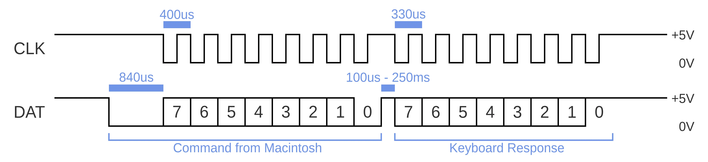

*Macintosh 128k/512k/Plus keyboard signaling*

To briefly describe the protocol, the keyboard first waits for a falling edge on the data line indicating a command from the host. This signals the keyboard to generate a square-wave for eight clock cycles. On each falling edge of the clock signal, the host sends a new bit to the keyboard which reads it on the following rising edge. The eight bits sent from the host to the keyboard is the command to which the keyboard responds. The keyboard then generates another eight clock cycles to send the response byte. There are four different commands for the keyboard to respond to: the "test" command, "model" command, "inquiry" command, and "instant" command. In response to an "inquiry" command, the keyboard polls key transitions for a maximum of 0.25 seconds. If no key has transitioned, a NULL code is returned. An "instant" command is responded to immediately without the 0.25 second polling.

<br>

## USB to M0110 Keyboard Adapter

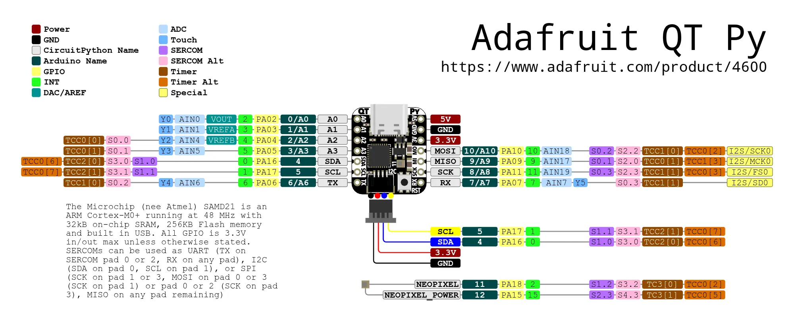

*Adafruit QT Py SAMD21 pinout diagram from the [Adafruit Website](https://learn.adafruit.com/adafruit-qt-py/pinouts)*

To make the USB to M0110 adapter, I needed a microcontroller with USB host capabilities and two GPIO pins for the clock and data signals. I had a spare Adafruit QT Py SAMD21 board which fit those requirements while also matching the theme of "Adorably Compact Computers". I used GPIO pin 0 for the clock signal and pin 1 for the data signal. With both pins I used a 470 ohm resistor in series to protect the 3.3V microcontroller from the 5V logic level of the keyboard port. To connect a keyboard to the QT Py, I simply plugged a USB to USB-C adapter into the board's USB-C port.

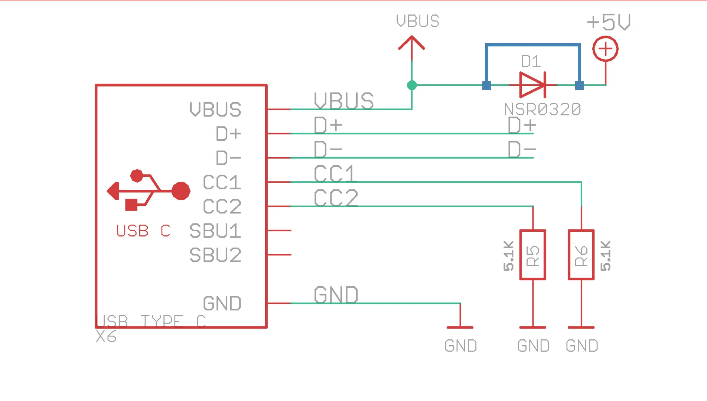

*The USB protection diode needs to be jumped to supply the keyboard.*

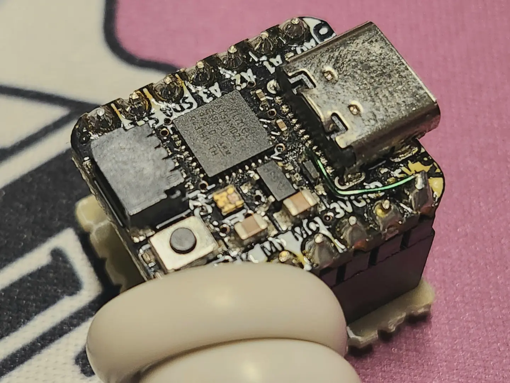

*Adafruit QT Py SAMD21 with the USB protection diode bypassed*

To power a USB keyboard hosted by the QT Py, I needed to route the 5V from the Macintosh keyboard port to the VBUS rail on the QT Py's USB-C port. That rail is not accessible via the header pins on the board so I had to bypass the diode between +5V pin and VBUS. This was done with a short length of magnet wire.

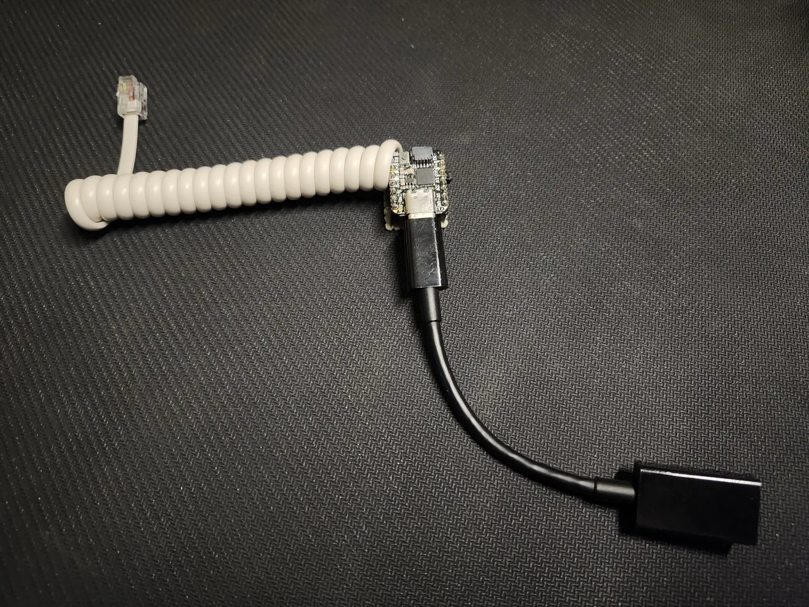

*USB to M0110 keyboard adapter made with an Adafruit QT Py SAMD21*

To complete the adapter, I bought a telephone cable at a local hardware store. I tested everything on a breadboard before soldering it all together for easier handling.

<br>

## Writing the M0110 Library

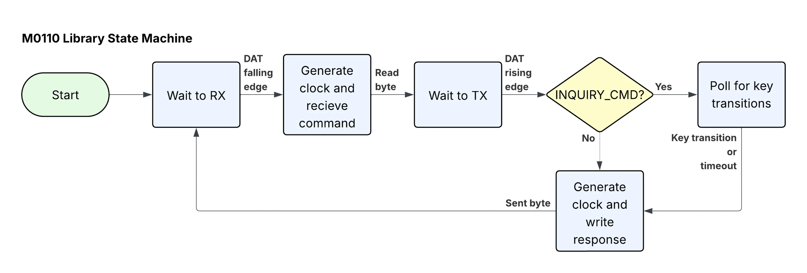

*M0110 protocol state machine from the perspective of the keyboard*

I programmed the QT Py with [PlatformIO](https://platformio.org/) using the Arduino framework. To mimic a Macintosh keyboard, I wrote an Arduino Library to communicate via the M0110 protocol. The protocol was implemented in a state machine that roughly follows the above diagram. The state machine is fed data events from digital interrupts that can be attached and detached from the data pin. Timing events were driven using the TC3 timer, available on SAMD microcontrollers. Key transitions are queued and dequeued from a circular buffer that can hold up to 100 bytes. Key transition bytes contain a transition bit, 0 for press and 1 for release, followed by a 6 bit scan code representing the key. Response bytes from the keyboard always end with a 1.

```txt
Key Transition Byte:
.-------------------------------------------------------------------.
| transition bit |               scan code               | always 1 |
'-------------------------------------------------------------------'
      bit 7                      bits 6-1                   bit 0
```

```cpp
uint8_t keyPressByte   = ((scancode & 0x7F) << 1) | 0x01;
uint8_t keyReleaseByte = ((scancode & 0x7F) << 1) | 0x81;
```

I wanted the library to inherit functions from the builtin `Print` library similar to the [Arduino Keyboard Library](https://docs.arduino.cc/language-reference/en/functions/usb/Keyboard/). This allows the use of functions such as `print()` and `write()` that accept ASCII encoded characters and strings. in order to do this I made a array, `_M0110_AsciiToScanCode[asciiCharacter]`, to map between ASCII bytes and the 6 bit scan codes. The following table is the final mapping I used.

```txt
Ascii   Char      Key      Scan Code  | Ascii   Char      Key       Scan Code  | Ascii   Char      Key       Scan Code  | Ascii   Char      Key       Scan Code 
--------------------------------------+----------------------------------------+----------------------------------------+---------------------------------------
 0x00    NUL       -            -     |  0x20    SP      space         0x31    |  0x40     @    shift + 2   0x38 + 0x13 |  0x60     `        `           0x32   
 0x01    SOH       -            -     |  0x21     !    shift + 1   0x38 + 0x12 |  0x41     A    shift + a   0x38 + 0x00 |  0x61     a        a           0x00   
 0x02    STX       -            -     |  0x22     "    shift + '   0x38 + 0x27 |  0x42     B    shift + b   0x38 + 0x0B |  0x62     b        b           0x0B   
 0x03    ETX       -            -     |  0x23     #    shift + 3   0x38 + 0x14 |  0x43     C    shift + c   0x38 + 0x08 |  0x63     c        c           0x08   
 0x04    EAT       -            -     |  0x24     $    shift + 4   0x38 + 0x15 |  0x44     D    shift + d   0x38 + 0x02 |  0x64     d        d           0x02   
 0x05    ENQ       -            -     |  0x25     %    shift + 5   0x38 + 0x17 |  0x45     E    shift + e   0x38 + 0x0E |  0x65     e        e           0x0E   
 0x06    ACK       -            -     |  0x26     &    shift + 7   0x38 + 0x1A |  0x46     F    shift + f   0x38 + 0x03 |  0x66     f        f           0x03   
 0x07    BEL       -            -     |  0x27     '        '           0x27    |  0x47     G    shift + g   0x38 + 0x05 |  0x67     g        g           0x05   
 0x08    BS    backspace      0x33    |  0x28     (    shift + 9   0x38 + 0x19 |  0x48     H    shift + h   0x38 + 0x04 |  0x68     h        h           0x04   
 0x09    TAB      tab         0x30    |  0x29     )    shift + 0   0x38 + 0x1D |  0x49     I    shift + i   0x38 + 0x22 |  0x69     i        i           0x22   
 0x0A    LF      enter        0x34    |  0x2A     *    shift + 8   0x38 + 0x1C |  0x4A     J    shift + j   0x38 + 0x26 |  0x6A     j        j           0x26   
 0x0B    VT        -            -     |  0x2B     +    shift + =   0x38 + 0x18 |  0x4B     K    shift + k   0x38 + 0x28 |  0x6B     k        k           0x28   
 0x0C    FF        -            -     |  0x2C     ,        ,           0x2B    |  0x4C     L    shift + l   0x38 + 0x25 |  0x6C     l        l           0x25   
 0x0D    CR      return       0x24    |  0x2D    "-"      "-"          0x1B    |  0x4D     M    shift + m   0x38 + 0x2E |  0x6D     m        m           0x2E   
 0x0E    SO        -            -     |  0x2E     .        .           0x2F    |  0x4E     N    shift + n   0x38 + 0x2D |  0x6E     n        n           0x2D   
 0x0F    SI        -            -     |  0x2F     /        /           0x2C    |  0x4F     O    shift + o   0x38 + 0x1F |  0x6F     o        o           0x1F   
 0x10    DLE       -            -     |  0x30     0        0           0x1D    |  0x50     P    shift + p   0x38 + 0x23 |  0x70     p        p           0x23   
 0x11    DC1       -            -     |  0x31     1        1           0x12    |  0x51     Q    shift + q   0x38 + 0x0C |  0x71     q        q           0x0C   
 0x12    DC2       -            -     |  0x32     2        2           0x13    |  0x52     R    shift + r   0x38 + 0x0F |  0x72     r        r           0x0F   
 0x13    DC3       -            -     |  0x33     3        3           0x14    |  0x53     S    shift + s   0x38 + 0x01 |  0x73     s        s           0x01   
 0x14    DC4       -            -     |  0x34     4        4           0x15    |  0x54     T    shift + t   0x38 + 0x11 |  0x74     t        t           0x11   
 0x15    NAK       -            -     |  0x35     5        5           0x17    |  0x55     U    shift + u   0x38 + 0x20 |  0x75     u        u           0x20   
 0x16    SYN       -            -     |  0x36     6        6           0x16    |  0x56     V    shift + v   0x38 + 0x09 |  0x76     v        v           0x09   
 0x17    ETB       -            -     |  0x37     7        7           0x1A    |  0x57     W    shift + w   0x38 + 0x0D |  0x77     w        w           0x0D   
 0x18    CAN       -            -     |  0x38     8        8           0x1C    |  0x58     X    shift + x   0x38 + 0x07 |  0x78     x        x           0x07   
 0x19    EM        -            -     |  0x39     9        9           0x19    |  0x59     Y    shift + y   0x38 + 0x10 |  0x79     y        y           0x10   
 0x1A    SUB       -            -     |  0x3A     :    shift + ;   0x38 + 0x29 |  0x5A     Z    shift + z   0x38 + 0x06 |  0x7A     z        z           0x06   
 0x1B    ESC       -            -     |  0x3B     ;        ;           0x29    |  0x5B     [        [           0x21    |  0x7B     {    shift + [   0x38 + 0x21
 0x1C    FS        -            -     |  0x3C     <    shift + ,   0x38 + 0x2B |  0x5C     \        \           0x2A    |  0x7C     |    shift + |   0x38 + 0x2A
 0x1D    GS        -            -     |  0x3D     =        =           0x18    |  0x5D     ]        ]           0x1E    |  0x7D     }    shift + ]   0x38 + 0x1E
 0x1E    RS        -            -     |  0x3E     >    shift + .   0x38 + 0x2F |  0x5E     ^    shift + 6   0x38 + 0x16 |  0x7E     ~    shift + `   0x38 + 0x32
```

As you can see, not all ASCII characters can be represented as keys or key combinations. There are also keys that aren't naturally represented as ASCII characters such as the command, option, and arrow keys. I again implemented this similar to the Arduino Keyboard Library by defining an extended set of characters. As an example, the copy shortcut can be programmed as `press(MO110_COMMAND);` followed by `press('c');`. Some of these special keys are keypad or extended keypad keys that require extension codes to be queued before the key transition byte.

```txt
Ascii Ext.  Key                Scan Code
----------------------------------------
0x80        M0110_COMMAND      0x37     
0x81        M0110_SHIFT        0x38     
0x82        M0110_CAPS_LOCK    0x39     
0x83        M0110_OPTION       0x3A     
0x84        M0110_RIGHT_ARROW  0x02*    
0x85        M0110_LEFT_ARROW   0x06*    
0x86        M0110_DOWN_ARROW   0x08*    
0x87        M0110_UP_ARROW     0x0D*    
0x88        M0110_KP_DOT       0x01*    
0x89        M0110_KP_CLEAR     0x07*    
0x8A        M0110_KP_ENTER     0x0C*    
0x8B        M0110_KP_MINUS     0x0E*    
0x8C        M0110_KP_0         0x12*    
0x8D        M0110_KP_1         0x13*    
0x8E        M0110_KP_2         0x14*    
0x8F        M0110_KP_3         0x15*    
0x90        M0110_KP_4         0x16*    
0x91        M0110_KP_5         0x17*    
0x92        M0110_KP_6         0x18*    
0x93        M0110_KP_7         0x19*    
0x94        M0110_KP_8         0x1B*    
0x95        M0110_KP_9         0x1C*    
0x96        M0110_KP_ASTERISK  0x02**   
0x97        M0110_KP_PLUS      0x06**   
0x98        M0110_KP_EQUALS    0x08**   
0x99        M0110_KP_SLASH     0x0D**   

Extension Codes (Full 8 bits):
KEYPAD               0x79
KEYPAD_EXT_KEYDOWN   0x71
KEYPAD_EXT_KEYUP     0xF1

[*]  KEYPAD + [Key Transition Byte]
[**] KEYPAD_EXT_KEYDOWN + KEYPAD + [Key Transition Byte]
  or KEYPAD_EXT_KEYUP + KEYPAD + [Key Transition Byte]
```

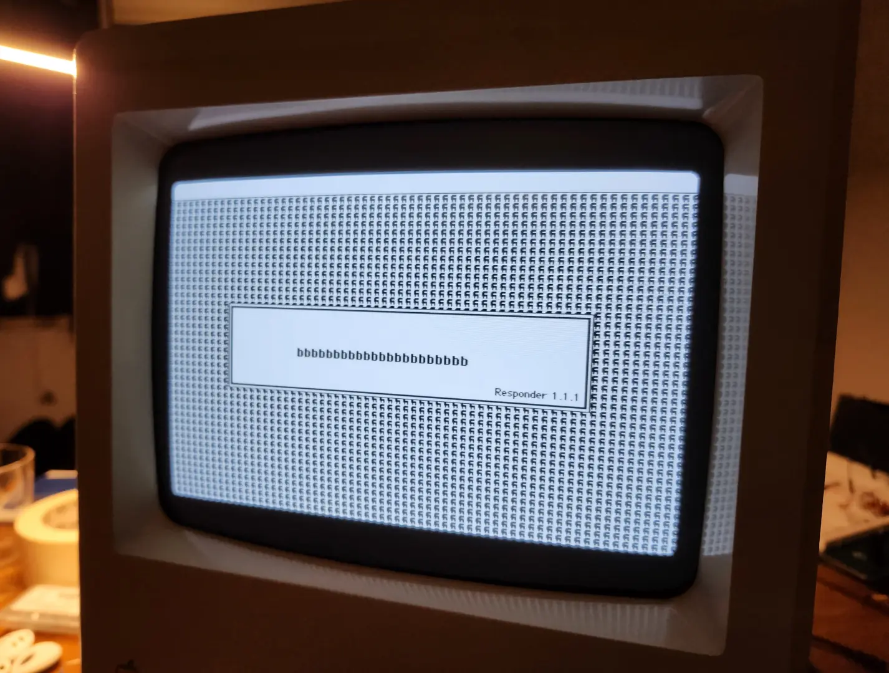

*First letter typed on the Macintosh!*

I did not have a mouse when I was first testing the library. This didn't end up being a problem since the Macintosh would time out and conveniently open a prompt with a text entry field. I started with hard-coded key transitions but once I wrote the ASCII-to-scan-code mapping, I was able to mirror bytes sent through a serial console from my laptop.

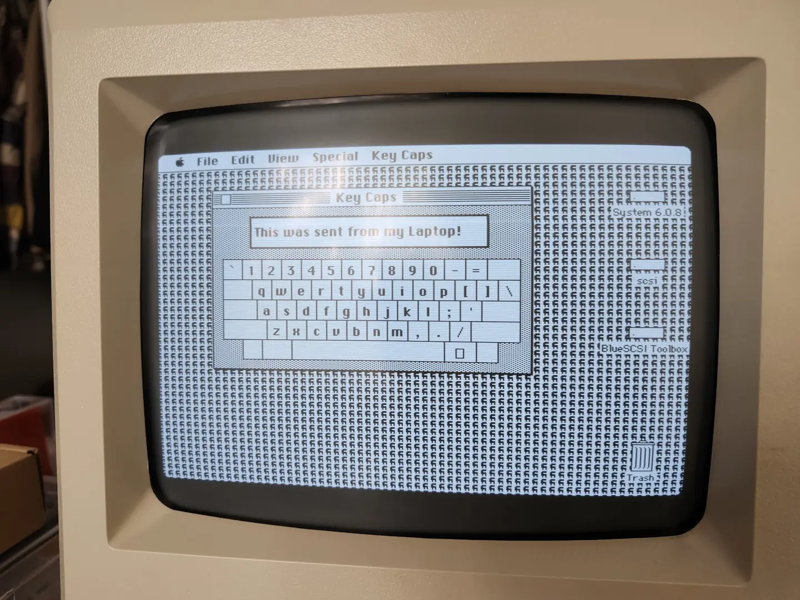

*typing using a serial console*

After making sure all the keys worked properly, I wrote another array that mapped the OEM key codes sent from USB keyboards to the ASCII codes used by the library. Both the serial console and USB keyboard programs are saved as examples with the [M0110 Library on GitHub](https://github.com/zeropt/M0110).

<br>

## Result

The final adapter worked better than I expected and being my first Arduino library, I'm especially happy with how the M0110 library turned out. To use the library in your own project, download it from the [GitHub repository](https://github.com/zeropt/M0110) into your project's library folder. After initializing it with a data and clock pin, it can be used like the [Arduino Keyboard Library](https://docs.arduino.cc/language-reference/en/functions/usb/Keyboard/).

```cpp
#include <M0110.h>

#define DAT_PIN 1
#define CLK_PIN 0

M0110 m0110(DAT_PIN, CLK_PIN);

void setup() {
	m0110.begin();
	m0110.print("Hello, world!");
}
```

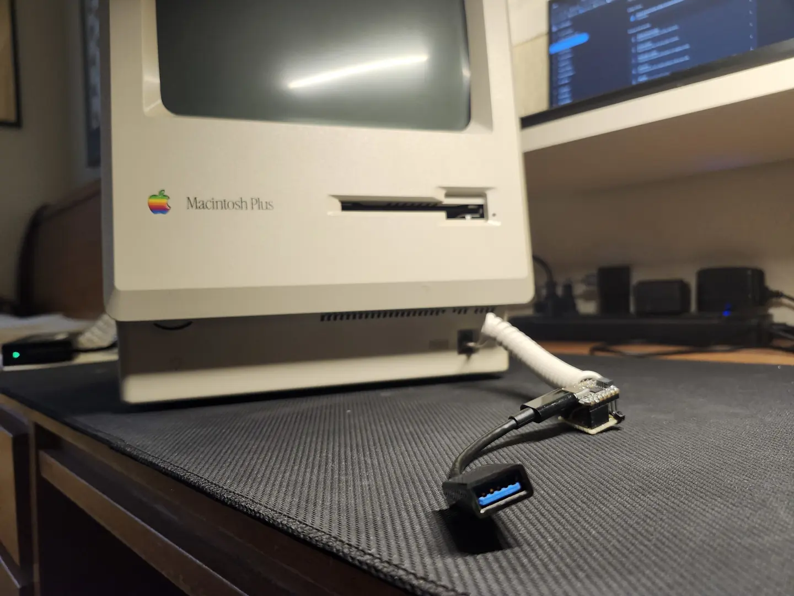

*Macintosh Plus with the USB to M0110 keyboard adapter*

After making the keyboard adapter, I had fun poking around Apple System 6.0.8 and experiencing the tediousness of floppy disk swapping. I was able to play some games, draw in PhotoShop 0.63, use a C programming IDE from the 80s, and even try Python 1.1. Unfortunately, my Macintosh Plus no longer boots properly and I haven't been able to fix it yet but it was fun while it lasted.

&#x1F44B; Happy Hacking!

<br>
