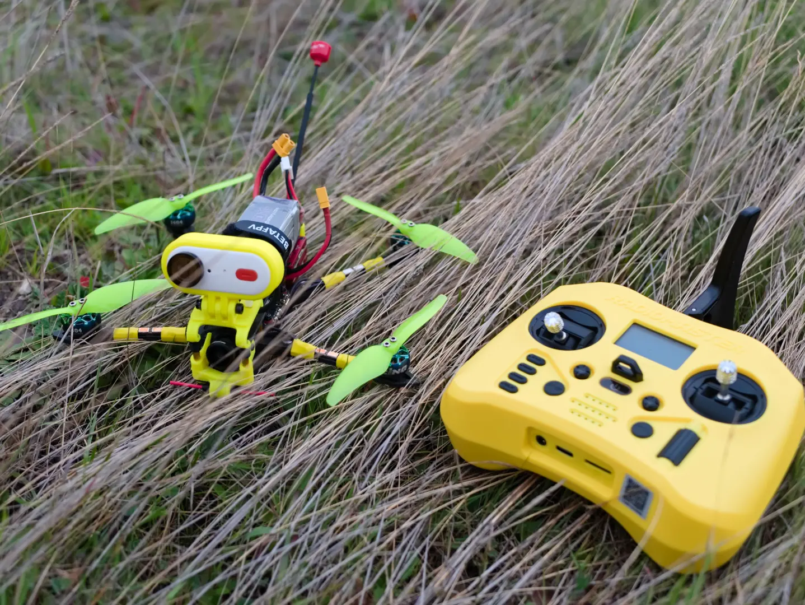
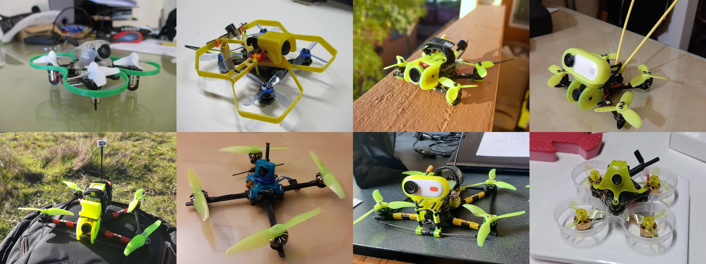
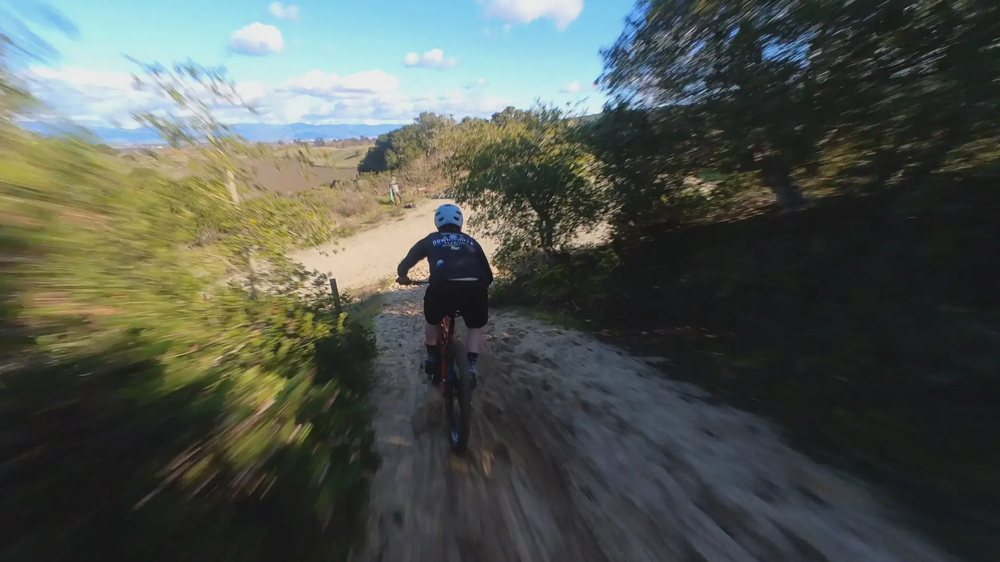
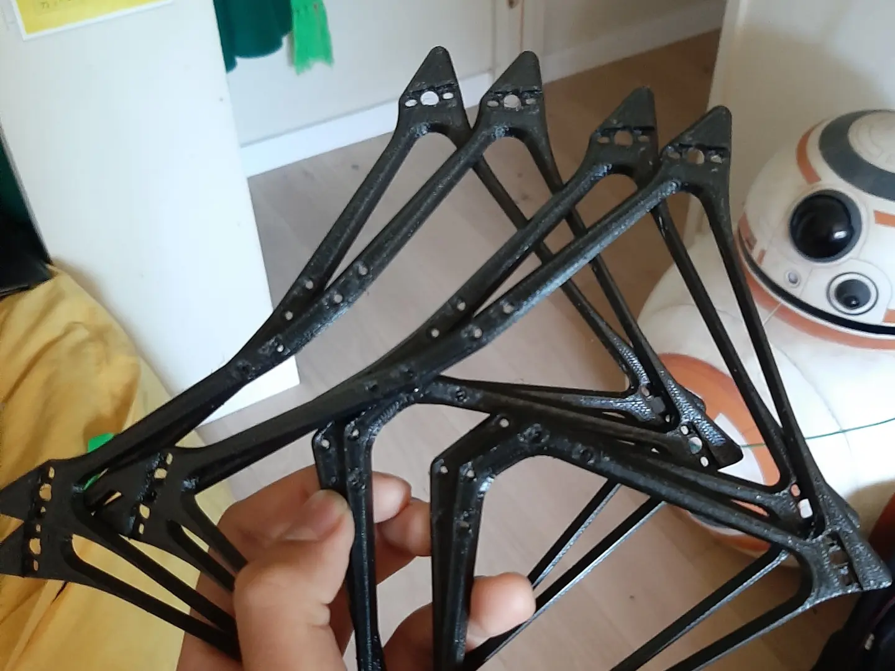
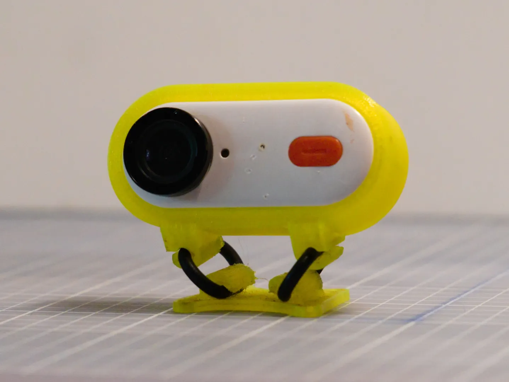
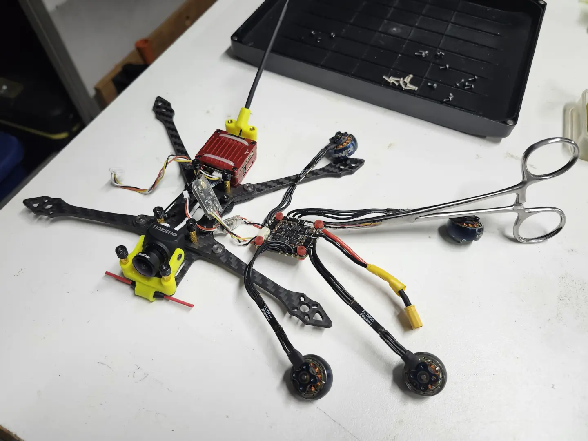
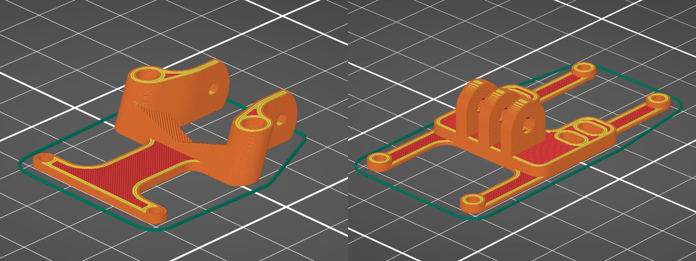
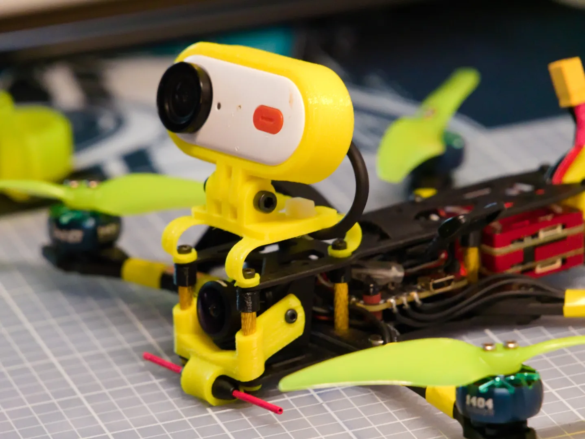
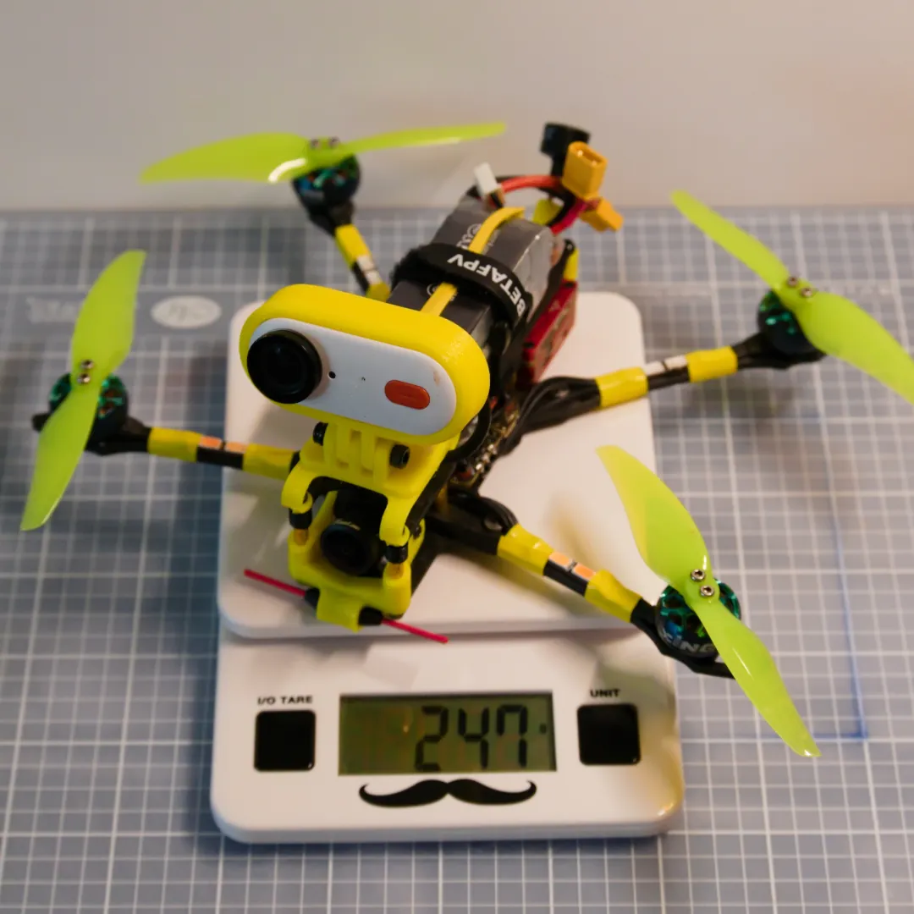
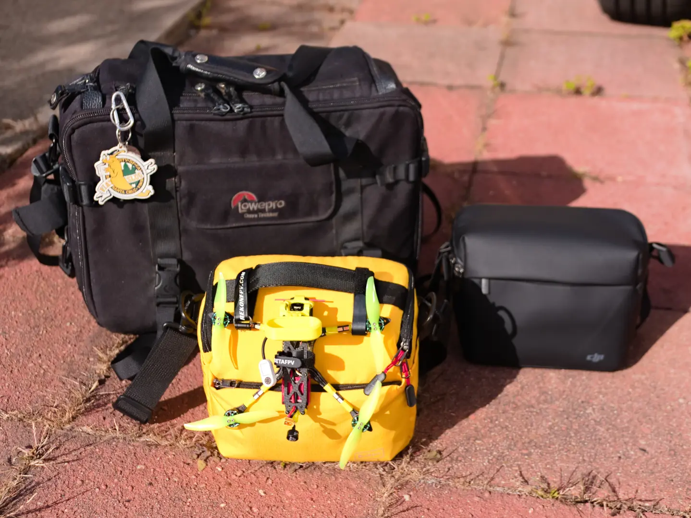

# Updating my 4" FPV Quadcopter for 2025

May 2025

After graduating, one of the first projects I wanted to check off the backlog was repairing one of my FPV drones. For over a year, I had a [Rekon 4 LR Frame Kit](https://rekonfpv.com/products/rekon-4-frame-kit-4-inch-frame-kit-naked-gopro-smo-4k-mount-for-fpv-racing-drone) just waiting to be put together. I have built and flown similar configurations using the same 1404 brushless motors and 4 inch diameter propellers. I wanted this iteration to be simple, resilient, and easily hikeable when paired with minimalistic gear. In this project entry I will write about some of the past FPV quadcopters I've built before describing this updated configuration.

 

## Previous Iterations

*These are some of the past iterations I've built, some with 3D printed frames. Not all of them flew.*

I was introduced to FPV racing drones through a drone lab I interned for while in high school. I had flown radio controlled fixed-wing aircraft before and would love to get back into RC slope soaring if I find the time. After the internship, I started playing around with the palm-sized Tiny Whoop form factor. These were loads of fun and didn't disturb anyone other than my immediate family. Learning how to build and fly small FPV quadcopters became my COVID hobby and I experimented with all sorts of configurations using 3D printed frames.

*Chasing a friend on his mountain bike*

My favorite form factor so far is the micro long-range style modeled after a [design by Dave_C FPV](https://www.thingiverse.com/thing:4054381). It uses 4 inch diameter propellers, 1404 sized brushless motors, and is capable of carrying a small action camera with ease all while weighing less than 250 grams. All the micro LR iterations I built and flew used 3D printed frames. To keep the flight duration and performance I wanted, the arms and braces were kept light and thin which worked fine as long as I didn't crash. When I did crash, I would have to replace the arms with spares. Even though the design was repairable in the field, the time spent repairing is still time taken away from flying. This led to finally buying a frame kit cut out of carbon fiber plate.

*Spare 3D printed frames I would bring on trips since crashes were inevitable*

 

## Goals for this build

*The previous mount for the action camera used rubber o-rings to reduce jello.*

Going into this build there were aspects I wanted to update all while keeping some of the factors I liked about the previous versions. These are the aspects I wanted to keep:

- At least 6 minutes of cruising flight
- All-up-weight less than 250 grams
- Strong control and video link throughout the flyable distance
- Vibration isolation for the action camera to suppress rolling shutter wobbles "jello effect"

These are the aspects I wanted to update:

- Robust enough to handle light crashes without the need for repair
- Hinged action camera mount for adjustable camera angle
- Level action camera mount: The old mount used rubber o-rings which could hinge and sometimes allowed the camera to roll to one side or the other.
- Compact 15 mm deck height (just enough to fit the HDZero Freestyle V2 video transmitter)

 

## Main Components

In case you are interested, I'll list the main components I used in the build.

*Some of the components are more visible while repairing the aircraft.*

**Frame:** [Rekon 4 Frame Kit](https://rekonfpv.com/products/rekon-4-frame-kit-4-inch-frame-kit-naked-gopro-smo-4k-mount-for-fpv-racing-drone)

The Rekon line is designed by Dave_C FPV and manufactured by HGLRC. To achieve a more compact deck height, I found [shorter M2 standoffs on NewBeeDrone](https://newbeedrone.com/products/newbeedrone-m2-aluminum-standoffs-various-color-length).

**Motors:** [Xing2 1404 3800kV Brushless Motors](https://shop.iflight.com/xing2-1404-toothpick-ultralight-build-unibell-pro1482)

The recommended motors for this frame are 1404 sized motors. I bought these specific motors about three years ago and they still work. The ones rated 3800kV work well with the 3 cell batteries I use.

**Propellers:** Gemfan Hurricane 4024 Bi-Blades [[NBD](https://newbeedrone.com/collections/all/products/gemfan-4024-hurricane-durable-2-blade-1-5mm)] [[Pyro](https://pyrodrone.com/products/gemfan-hurricane-4024-2-blade-4-durable-prop-4cw-4ccw-choose-color)] [[RDQ](https://www.racedayquads.com/products/gemfan-hurricane-4024-durable-bi-blade-4-prop-8-pack-choose-your-color)]

I've also used HQProp's 4 inch bi-blades and Gemfan's folding tri-blades before. I have settled on the Gemfan Hurricane 4024 propellers because they are simple, durable, and come in yellow.

**Flight Controller + ESCs:** [GEPRC F411 35A AIO](https://geprc.com/product/gep-f411-35a-aio-f411-fc-35a-2-6s-8bits-bls-esc-25-5mm/)

The Rekon 4 LR frame comes with both a 20\*20 and 25.5\*25.5 mm mounting pattern for the flight controller. I have used small 20\*20 mm stacks before with the flight controller and ESCs on separate boards. To keep the deck height as short as possible while leaving room for components such as a receiver and BEC, I opted for an all-in-one (AIO) with 25.5\*25.5 mm mounting. Buying a whole new AIO is expensive so I bought one with a current rating higher than I necessarily needed in the hope that my ESCs would never burn out. I don't think they make the exact one I have anymore but there are plenty of comparable all-in-one flight controllers on the market.

**Receiver:** AxisFlying ExpressLRS Thor Receiver [[GetFPV](https://www.getfpv.com/axisflying-elrs-2-4ghz-radio-receiver.html)] [[NBD](https://newbeedrone.com/products/axisflying-expresslrs-elrs-thor-receiver)] [[RDQ](https://www.racedayquads.com/products/axis-flying-elrs-2-4ghz-receiver)]

This is a small ELRS 2.4 GHz receiver that comes with a small dipole antenna. ExpressLRS is a very popular control link for a reason. The simple 2.4 GHz ELRS receivers are lightweight, inexpensive, and maintain a robust enough signal for my purposes.

**Video Transmitter:** [HDZero Freestyle V2](https://www.hd-zero.com/product-page/freestyle-v2-vtx)

I bought a pair or HDZero goggles when they were released and I still love them a couple years later. The Rekon 4 LR frame has a 20\*20 mm mounting pattern for a VTX with enough space for the HDZero Freestyle V2. Mounting it there with a couple of zip ties did the job nicely.

**FPV Camera:** [HDZero Micro V3](https://www.hd-zero.com/product-page/hdzero-micro-v3-camera)

I had both the HDZero Nano V2 and Micro V3 cameras. While the Nano V2 is a couple grams lighter than the Micro V3. After flying both I decided on using the Micro V3 to be able to switch into 1080p30 mode without a lens mod.

**Batteries:** GNB 3S 1100 mAh XT30 [[Pyro](https://pyrodrone.com/products/gaoneng-gnb-1100mah-3s-11-4v-60c-120c-lipo-battery-xt30)]

These offer 12.2 Wh while weighing ~70 grams. At sea level, I get flight times between 5 and 8 minutes depending on how I'm flying.

**Action Camera:** [CADDXFPV Peanut](https://caddxfpv.com/products/caddx-peanut-action-camera)

This is a thumb-sized action camera capable of recording 1440p video. The Caddx Peanut is basically an Insta360 Go 2 with a hard plastic shell and a magnetic power connector for in-flight charging and camera control. I use it with [Gyroflow](https://gyroflow.xyz/) for video stabilization.

 

## 3D Prints

Though I didn't 3D print the frame for this build, I still needed mounts to attach the video antenna, receiver antenna, FPV camera, and action camera. I print these out of TPU which can flex similar to rubber and results in super durable parts.

*Some of the mounts are printed flat before being flexed when mounted.*

I designed all the mounts in OnShape using test prints to see how everything fit. By flexing TPU mount around the bottom plate, the 2.4 GHz dipole for the ELRS receiver is mounted using the same mount for the FPV camera. Similarly, the action mount for the action camera is flexed to provide vibration isolation between the frame and action camera. I thought about looking up the properties of the TPU I used so that I could tune the mount to dampen the motor frequencies I recorded via Betaflight blackbox logging. Instead, I started with an arbitrary thickness of 2 mm for the TPU legs and flew test flights making sure to use the full throttle range. I then reduced that thickness until I didn't see any more rolling shutter wobbles in the recorded video.

*The Caddx Peanut action camera, FPV camera, and ELRS dipole antenna are mounted using flexed TPU prints.*

These mounts were designed for my specific configuration of components but in case anyone wants them, I uploaded the files to Printables. In case you want to modify the designs, I will also share the link to the OnShape document.

[Printables Model](https://www.printables.com/model/1284293-custom-tpu-mounts-for-rekon-4-lr-frame-with-caddx)

[OnShape Project](https://cad.onshape.com/documents/b3228f6668975707d5446776/w/e45a9fde10f9faf4fc3e7061/e/9a33c8571fec3af3037e9d65)

 

## Results

*The final weight including the action camera and a battery*

After flying, crashing, and fine-tuning the build for a couple of weeks, here are the results in terms of the original goals:

- &#x2705; At least 6 minutes of cruising flight
- &#x2705; &#x274C; All-up-weight less than 250 grams
- &#x2753; Strong control and video link throughout the flyable distance
- &#x2705; Vibration isolation for the action camera to suppress rolling shutter wobbles "jello effect"
- &#x2705; &#x274C; Robust enough to handle light crashes without the need for repair
- &#x2705; Hinged action camera mount for adjustable camera angle
- &#x2705; Level action camera mount
- &#x274C; Compact 15 mm deck height

I am happy with the performance overall. I experienced flight times between 5 and 8 minutes with casual cruising flight easily reaching 6 minutes. After a few prototype action mounts, the recorded video is now jello-free even on sunny days. It is now super easy to set the camera angle of both cameras and the mount now naturally holds the camera level.

Now for the aspects the didn't quite reach or partially reached the goal: I have two different sets of 1100 mAh batteries and the all-up-weight of the aircraft is either just under or just over the 250 gram limit depending on which batteries I use; as for durability, the frame has survived multiple crashes so far with no damage but one crash did rip out the video antenna; and lastly, the HDZero Micro V3 camera needed 2 mm of extra deck space resulting in a final deck height of 17 mm. The long video antenna needs to be replaced and its durability can be improved with either glue or a zip tie. While 17 mm is not as compact as the original goal, it is still more compact than the previous versions and the extra room allows more room to route the battery lead towards the back of the aircraft.

*FPV bag size comparison: old setup (back left), new setup (front center), and DJI Mavic Mini Shoulder Bag (back right)*

The final undefined and ongoing goal of the update is improving the portability of all my gear. I was always envious of the small bags able to carry the gear for the DJI Mini line. I didn't expect to achieve that level of portability since FPV drones additionally require a set of FPV goggles but low-profile goggle antennas and a small radio help to approach that target. One of the reasons for switching to ExpressLRS was to take advantage of small radios like the RadioMaster Pocket.

I love the small size of the Pocket but one disadvantage is the 250 mW maximum output power of the built-in ELRS module. In my flights so far, the HDZero Freestyle VTX acts somewhat similar to the old analog VTX I used and I haven't been able to thoroughly test whether or not the control link can out compete the video signal. I one flight I conducted, I encountered RXLOSS warnings before losing video that did not inspire confidence. Regardless, I still intend to stick with the Pocket for the sake of portability.

 

## Future Plans

You made it to the end of this build log for my 4" FPV quadcopter! I plan to fly this iteration as is for the time being but I do have a few future modifications in mind.

- **Fixed antenna:** The longer video antenna I used got ripped out in a crash. It broke where the coax cable meets the U.FL connector. When I get a replacement antenna, I plan to either glue the antenna to its TPU mount or update the mount so that a zip tie could be fed through it.
- **Head-tracking controlled camera tilt:** The idea is to use a micro servo to tilt both cameras in the pitch axis. This would allow me to actively control the natural rate at which I'm flying all while keeping the horizon at a reasonable level. I have currently used up my weight budget but with a smaller battery and/or action camera, I might be able to fit that mechanism.
- **3S to 4S:** At some point I want to try 4 cell batteries with lower kV motors to keep the same flight duration but allow for more performance when needed.
- **HDZero Nano 90:** As someone who is using the HDZero video system it's impossible not to hear the praise for their 90 fps camera. I do not use this drone to race or even freestyle really but I would like to try it out regardless.

Ciao!

 
