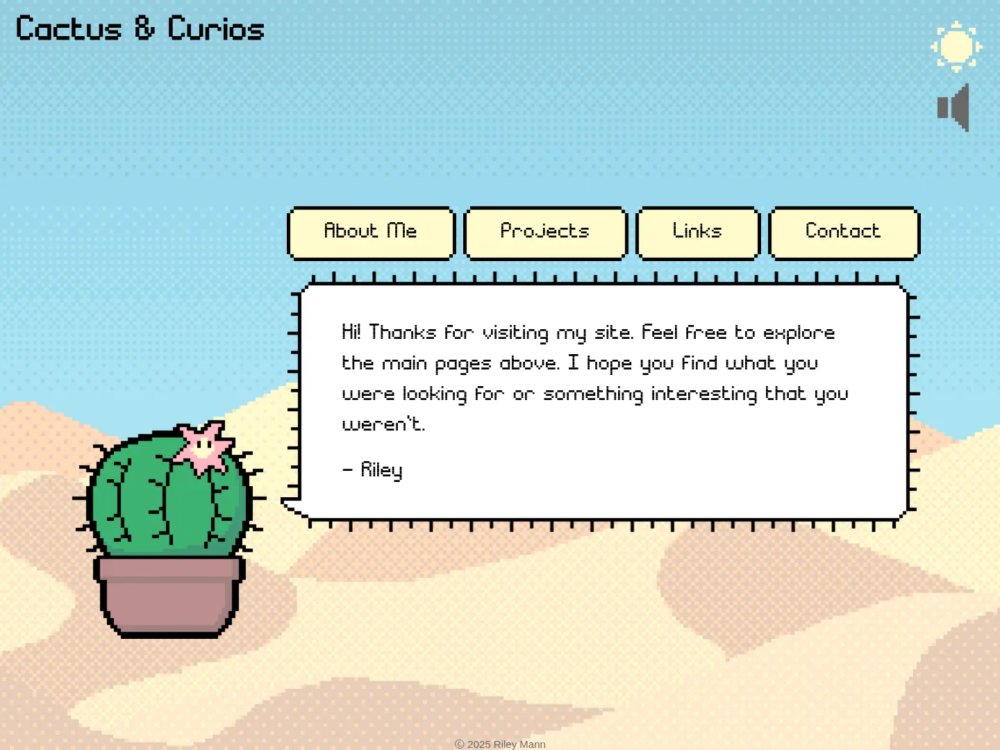
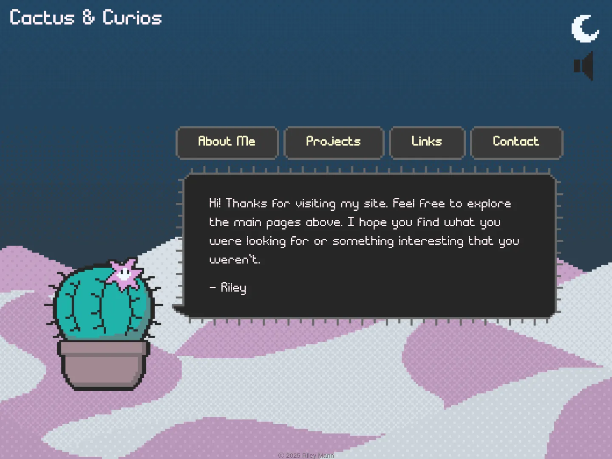
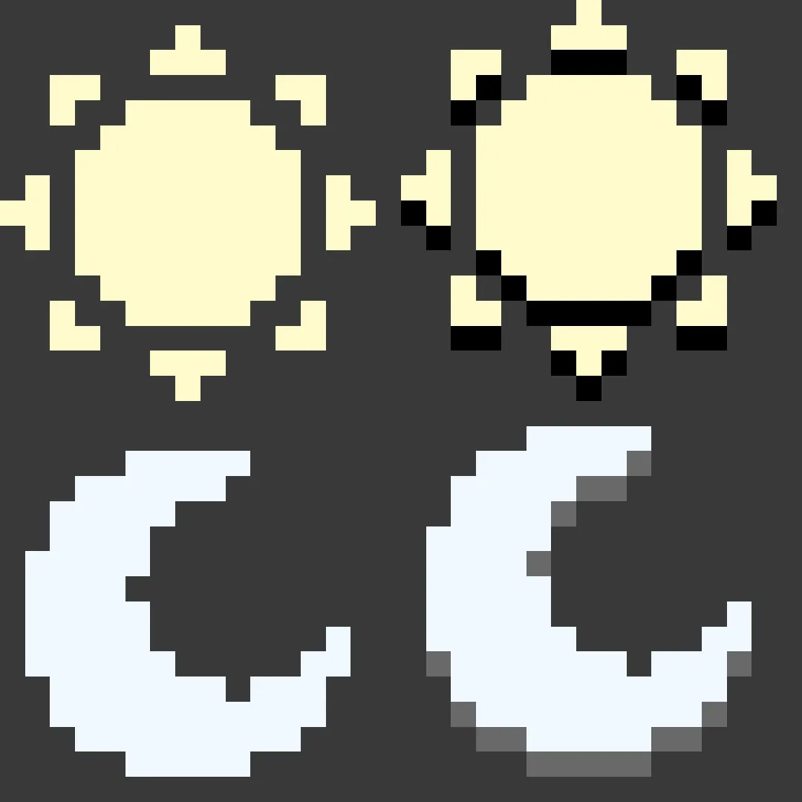
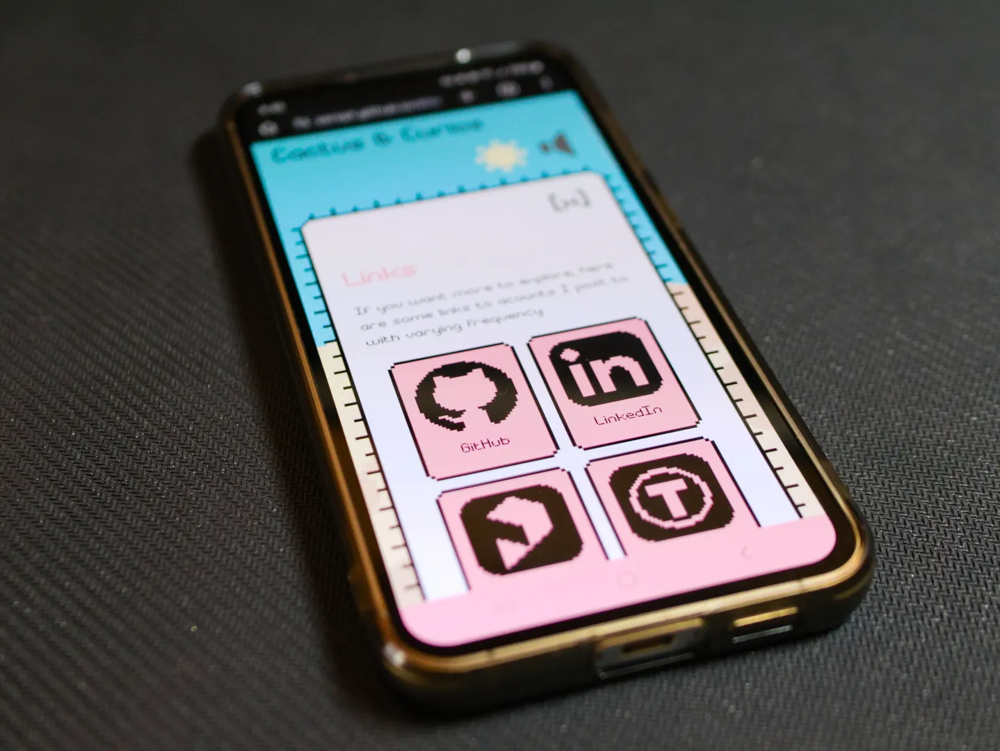
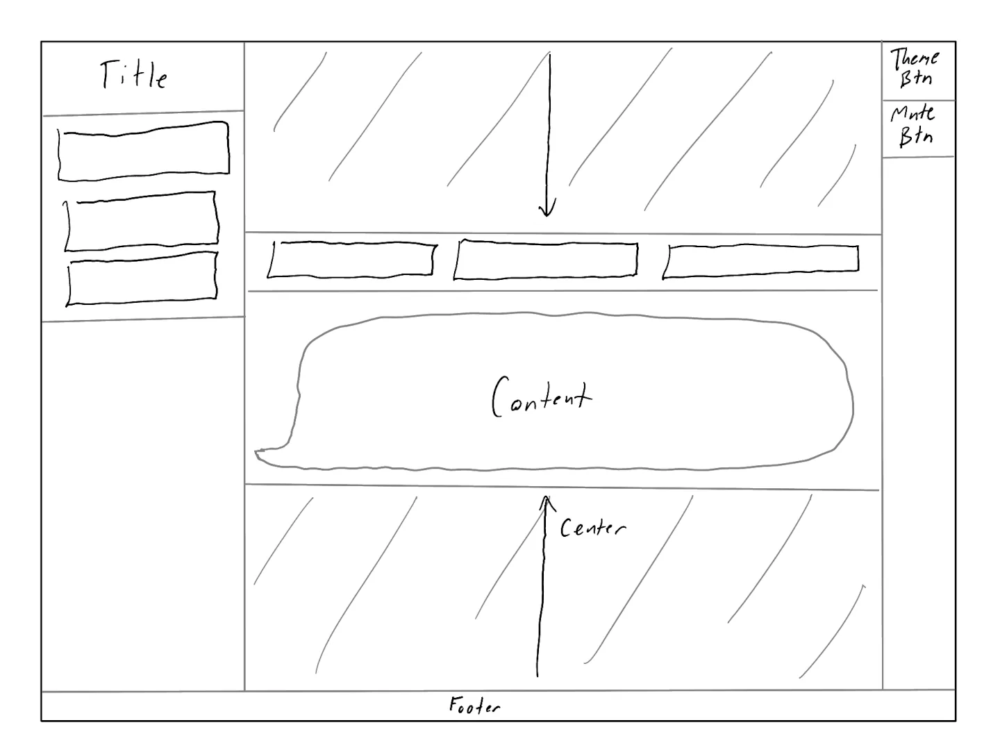

# Making a Personal Website: Cactus & Curios

May 2025



I was recently inspired to make a fun personal website that I could share with friends and potential employers. The original goal was to simply collect and write about my personal projects but this quickly turned into another fun project of its own.

<br>

These are the JavaScript libraries I used and what I used them for:

- [**jQuery**](https://jquery.com/) for element selection and manipulation, event handling, and simple animations
- [**Marked**](https://github.com/markedjs/marked) to load the project pages which are written in Markdown
- [**howler.js**](https://howlerjs.com/) for the clicky sound effects
- [**highlight.js**](https://highlightjs.org/) to style code blocks with syntax highlighting

<br>

I'll link the GitHub repository [here](https://github.com/zeropt/zeropt.github.io) for if you want to poke around.

Three years ago, I took a class that introduced me to the basics of HTML, CSS, and JavaScript. I had unfortunately forgotten all but the core concepts. Things like anchor elements, jQuery callbacks, and almost the entirety of CSS had to be relearned. In the following sections I'll recount some aspects that I found interesting and/or challenging.

<br>

## Light & Dark Theme



*The welcome page dark themed*

I spent far too much time scrutinizing over color codes to find colors that looked pleasing together. Using the [named CSS colors](https://www.w3schools.com/colors/colors_groups.asp) really helped to give me a starting point. To switch the text and background colors, I found CSS variables to be convenient as I could define color variables that can switch values wherever I used them. Here is an example of how I themed the text color.

```css
:root { /* Default: Light Theme */
	--text-color: black;
}

.dark { /* Dark Theme */
	--text-color: lavenderblush;
}

body {
	color: var(--text-color);
}
```

Then to toggle the theme, I simply needed to toggle the `dark` class on the `<html>` element using JavaScript.

```js
$("html").toggleClass("dark");
```

I decided that the light theme should be the default theme and opted against querying the device for the preferred theme. Instead, I added a theme button for the user to manually set their preference. The users' preferences are saved via local storage for when they revisit or reload the page.

<br>

## Sprite Sheets



*Theme button sprite sheet*

The text and background colors weren't the only themed components; The background images, buttons, and borders also need to change with the theme. For most, I drew two or more images and replaced the `background-image` and `border-image` source. I preferred to keep my file count down so I was excited to learn about using sprite sheets with CSS. For the theme button, as shown above, one image can contain the click state as well as the themed. Scaling this image to 2x the size of its button and setting it as the background crops in on the upper left quadrant. The sprite can then be changed by shifting it using the `background-position-x` and `background-position-y` properties. I ended up using this method for the theme button, mute button, logos, and even the cactus.


*Cactus sprite sheet*

<br>

## Navigation via URI Fragments

I wanted this website to be simple with at most a two layer navigation tree. Because of this, I decided to build the site as one page and load the selected page content using jQuery. At the same time, I also wanted the ability to send specific project pages to people via a URL and not just send them to the welcome page. Luckily URI fragments exist. The URI fragment is the string of characters that goes after the main URL following a hash symbol: `"http://www.example.org/#hello"`. This string can be read in JavaScript using `location.hash`. To set the page content and layout, I wrote a function, `loadPage(locHash)`, that takes that string as a parameter and configures the page accordingly. The function is run when the site is first loaded and whenever the fragment changes.

```js
loadPage(location.hash);
window.onhashchange = function(){loadPage(location.hash);};
```

With this system, navigation buttons are simply just anchors that set the fragment.

```html
<a href="#aboutme" class="button">About Me</a>
<a href="#welcome" class="close-btn">[x]</a>
```

<br>

## Responsive Design



*Content reorganizes on a smaller screen*

By far the most time consuming aspect of creating this website was getting it to respond well to different screen sizes. I designed the layout with desktop use in mind but I wanted it to at least be usable on a smartphone. A screen width media query and flexboxes are the two tools I ended up using to make the layout adapt to screen size.

### Screen Width Media Query

To modify CSS properties when displayed on a small screen, I made use of a media query to check if the window width is less than or equal to 800 px. This was written like the example below with all the small-screen styling written between the outer curly brackets.

```css
@media (max-width: 800px) {
	body {
		font-size: 0.75rem; /* font size when screen width <= 800 px */
	}
}
```

This was perfect for removing margins and padding that took up room, resizing elements such as the cactus, and changing flex container directions which I'll write about next.

### Flexboxes

Having never used these before, flexboxes took me a few days of tinkering to get the hang of and I still don't feel like I'm using them properly all the time. If you've never used these before, flexboxes are simply a way to organize boxes in rows or columns. There is also a powerful grid layout tool but rows and columns were all I ended up needing. There is plenty of documentation about these two layout methods online; I had those pages open at all times while I was building the layout. Basically, content that you want organized in a row or column get placed in a `<div>` together. When the `<div>` is styled using `display: flex;`, it becomes a flex container and the child elements become flex items. The `flex-direction` of the container can be set to `row`, `column`, or the reverse ordered versions of those. Using this, I was then able to layout the entire page as nested rows and columns.



*My sketch of the page using boxes for layout*

These rows and columns can also be set to wrap. This is very useful for reacting to screen width but became my biggest hurdle as I tried to figure out how to set the `width`, `min-width`, and `max-width` properties so that the flex items wrap when I wanted them to. One quirk that stumped me for a bit was that flex items do not naturally shrink smaller than the size of the content they hold unless their `min-width` or `min-height` is set to 0.

Something that came in handy for making responsive element dimensions were the `min()` and `max()` CSS functions. These functions respectively output the smallest and largest of the values given to them. For example `width: min(100ch, 100%);` sets an element's width to 100 characters but allows it to collapse when the available space shrinks below that.

Between the screen width media query and flexboxes that scale and wrap, the website should hopefully be usable on most screen sizes its viewed on.

<br>

## Final Thoughts

I really enjoyed the process of relearning how to build a simple website. Slowly tweaking the styling to get to the the result I have now was both exhausting and fulfilling as it slowly came together. As always, there are still a couple of things I want to add such as twinkling stars to the night sky which is starless at the time of writing. I hope you enjoy playing with all the clicky buttons as much as I do and maybe feel inspired to make a fun personal website of your own if you haven't already.

Enjoy!

<br>
